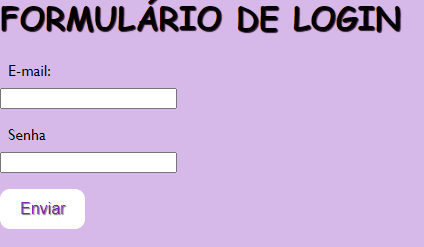

# índice
 
* [Projeto de escrita de README](#projeto-de-escrita-de-readme)
* [Descrição](#descrição)
* [Introdução](#introdução)
* [Funcionalidades](#funcionalidades)
* [Tecnologias Utilidades](#tecnologias-utilizadas)
* [Fontes Consultadas](#fontes-consultadas)
* [Autores](#autores)
 
# Projeto - Formulario de Login

 
## Descrição
- Este projeto é um formulário de contato básico em HTML, criado como parte de um exercício de prática. Ele permite que os usuários preencham informações de login através do formulário. É uma ótima maneira de aprender os conceitos básicos de criação de formulários em HTML.
 
## Introdução
- Preenchimento de dados e em informulario de login
 
 <
 
## Funcionalidades
- Aprender a construir uma tabela de formularios
 
## Tecnologias Utilizadas
- Visual Status Code
- GitHub
- CSS3
- html5
- MDN_
 
## Fontes Consultadas
- https://getbootstrap.com/
 
## Autores
- Yasmin [https://github.com/yasbatista/form_login]